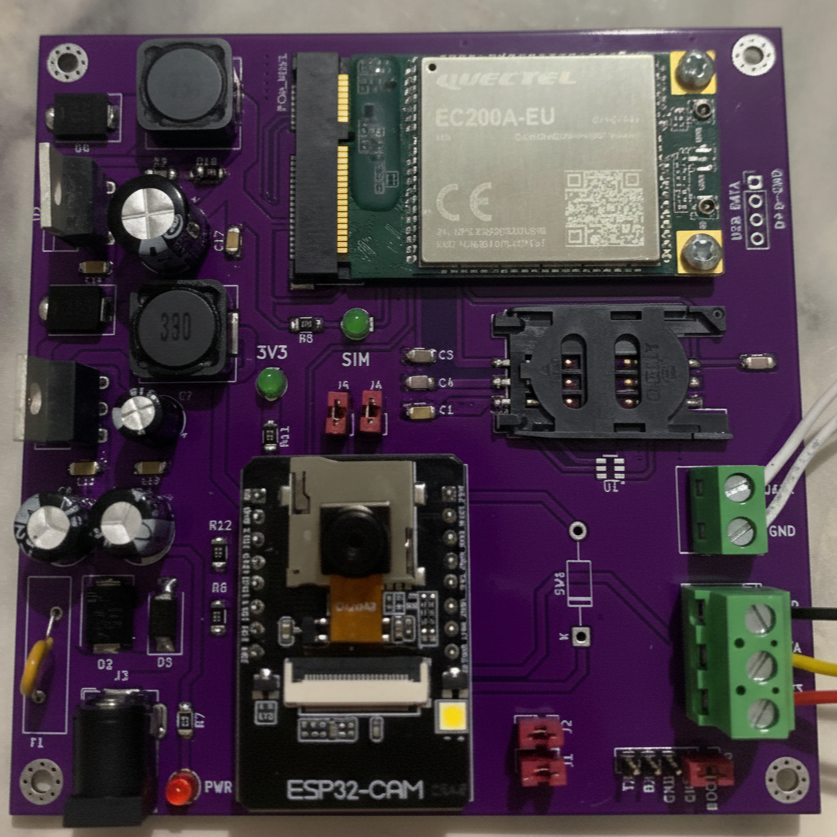
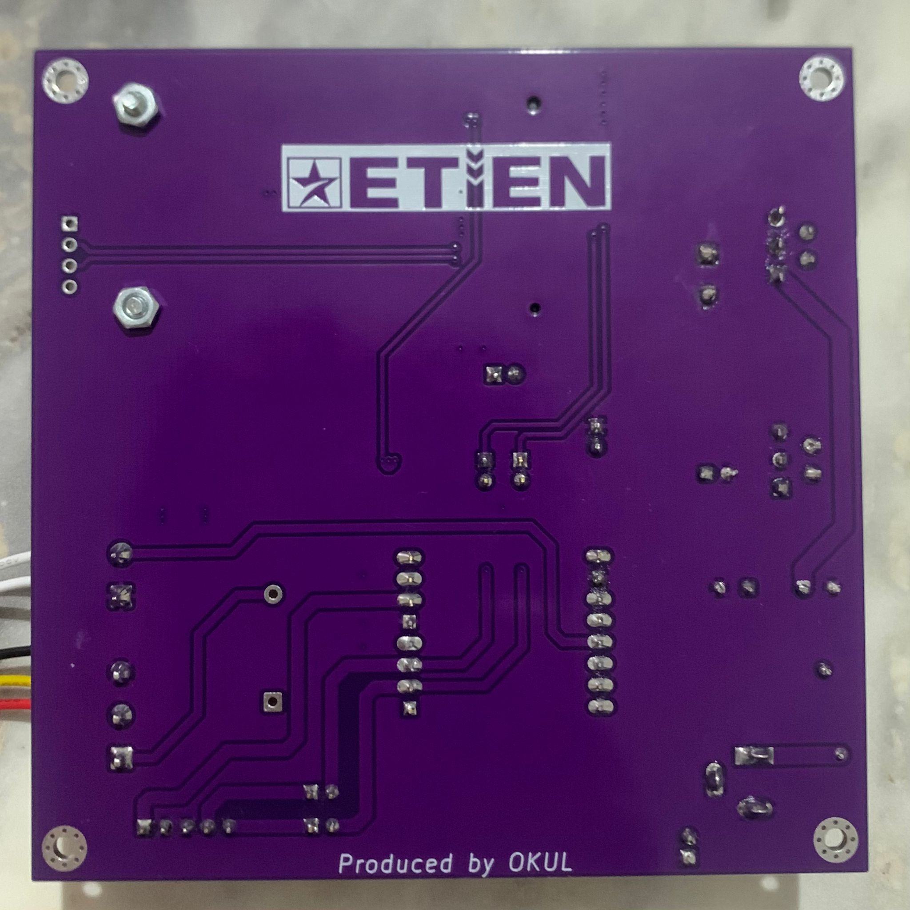

# 🌐 IoT-Based Smart Panel Telemetry & Security Board

**Hardware Showcase Portfolio**

A custom-designed, end-to-end industrial IoT hardware solution developed for remote tracking, environmental monitoring, and physical security of electrical panels. This project encompasses custom PCB design, hardware integration, and embedded software development.

> ⚠️ **Note:** This is a commercial/freelance project. Therefore, source codes, Gerber files, and detailed schematics are kept private to protect intellectual property. This repository serves as a hardware portfolio showcase.

## 📸 Hardware Overview

### Front View & Back View

  
  &nbsp; &nbsp; &nbsp; &nbsp;
  

## ⚙️ Core Components & Architecture

* **Microcontroller & Vision:** **ESP32-CAM Module**
    * Features a dual-core 240 MHz processor, 4MB PSRAM, and a 2MP (OV2640) camera. Capable of processing high-resolution images and transmitting them to servers instantly via Wi-Fi or cellular networks.
* **Cellular Communication:** **Quectel EC200A 4G/LTE Modem**
    * Industrial communication module ensuring uninterrupted internet access, SMS, and calling capabilities even in blind spots without Wi-Fi coverage. Supported by an external high-gain GSM antenna via an onboard IPEX connector.
* **Power Management:** **LM2596 Voltage Regulator**
    * Steps down the 12V industrial input to 4-5V with high efficiency and zero fluctuation. The power line is equipped with hardware-level fuse and reverse polarity protection against sudden current spikes and installation errors.

## 🛡️ System Capabilities

* **Flexible Data Transmission & Visual Alarms:** Instantly captures photos upon detecting unauthorized access or physical impact. The system is designed with endpoint flexibility, allowing data and images to be transmitted to **any configured server, custom web dashboards, cloud databases, or messaging APIs (e.g., Telegram)** within seconds.
* **Smart Energy Management (Deep Sleep):** When no threats are detected, the system enters "Deep Sleep" mode, reducing energy consumption to a minimum. It wakes up in milliseconds solely via hardware interrupt signals from the sensors.
* **Early Warning & Climate Telemetry:** Continuously analyzes the ambient temperature, humidity, and physical door status. Initiates emergency protocols before critical conditions (like condensation or overheating) escalate.
* **Production & Deployment:** A unique PCB layout was designed for stable operation. **15 units** were successfully manufactured, assembled, and deployed for field testing.

## 📡 Integrated Sensors

1.  **DHT21 Temperature & Humidity Sensor:** Provides highly accurate, real-time climate data from inside the electrical panel, essential for preventing hardware degradation due to extreme heat or moisture.
2.  **Magnetic Door Sensor:** Operates on the reed relay principle, continuously monitoring the door status and sending immediate trigger signals to the MCU upon unauthorized opening.
3.  **SW-420 Vibration Sensor:** A spring-type mechanical switch that detects physical impacts, tremors, and vibrations on the surface, transmitting them as physical interrupts.

---
### 👨‍💻 Designed & Developed by
**Uğur Selim Okul**
* Hardware Design (PCB) | Embedded Systems | IoT Integrations
